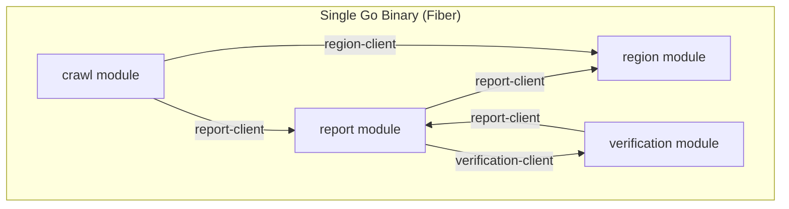
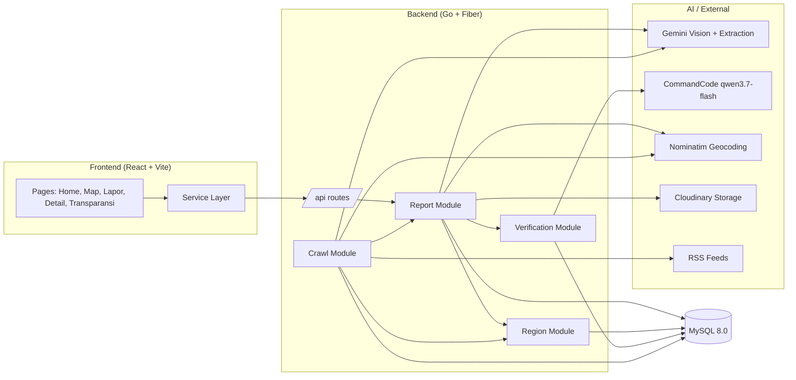
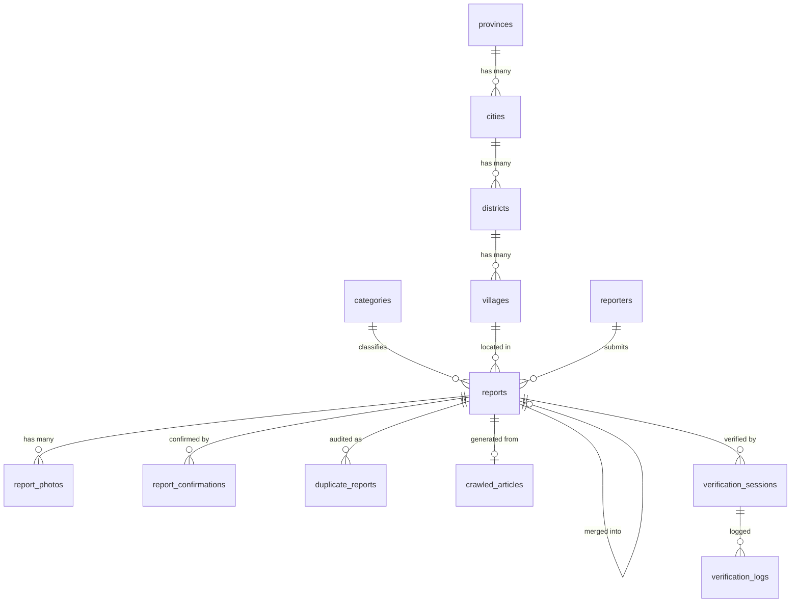

<div align="center">

  # Fixora
  ### Infrastructure Neglect Tracker — Pelacakan Akuntabilitas Infrastruktur Publik

  [](https://fixora-frontend.pages.dev/)
  [](https://github.com/arttVinci/fixora-Frontend)
  [](https://github.com/arttVinci/fixora-Backend)
  [](LICENSE)

  **Open Source Platform Transparansi & Akuntabilitas Infrastruktur Publik Indonesia**

  **By Saya Akan Lawan**

</div>

---

## 📋 Daftar Isi

- [Tim Developer](#-tim-developer)
- [Tentang Proyek](#-tentang-proyek)
- [Fitur Unggulan](#-fitur-unggulan)
- [Demo & Screenshot](#-demo--screenshot)
- [Teknologi](#-teknologi)
- [Arsitektur Sistem](#-arsitektur-sistem)
- [Instalasi & Setup](#-instalasi--setup)
- [Penggunaan](#-penggunaan)
- [API Documentation](#-api-documentation)
- [Lisensi](#-lisensi)

---

## 👥 Tim Developer

| Nama | Peran | GitHub |
|------|-------|--------|
| **[Putra Rizky Nugraha]** | Full-stack Developer | [GitHub](https://github.com/arttVinci) |
| **[Muhammad Fadhil Sevano]** | Full-stack Developer | [GitHub](https://github.com/MFSevanoo) |

---

## 🎯 Tentang Proyek

### Latar Belakang

Di kota-kota besar Indonesia seperti Jakarta dan Bekasi, masalah infrastruktur publik yang dibiarkan rusak dalam waktu lama — jalan berlubang, jembatan rawan roboh, bangunan terbengkalai, sampah menumpuk, drainase tersumbat — adalah persoalan berulang yang jarang mendapat akuntabilitas jangka panjang. Platform pelaporan yang ada (Qlue, LAPOR!) punya dua kelemahan utama: model "lapor sekali, selesai" tanpa mekanisme pelacakan durasi masalah, dan bersifat pasif (hanya menunggu laporan warga) sehingga mengalami *cold-start problem* di awal.

### Solusi yang Ditawarkan

Fixora mengisi celah ini dengan tiga diferensiasi kunci:

1. **Pelacakan durasi mangkrak** — bukan sekadar lapor, tapi mendokumentasikan *sudah berapa lama* suatu titik masalah dibiarkan.
2. **AI News Crawler otonom** — secara aktif mencari berita kerusakan infrastruktur dari media, sehingga platform punya data sejak hari pertama tanpa menunggu laporan warga.
3. **Verifikasi berlapis AI** — pipeline multi-agent (Advocate → Skeptic → Manager) memvalidasi setiap laporan sebelum tayang di peta publik.

### Tujuan Proyek

- 🎯 **Tujuan Utama**: Membangun platform *crowdsourced + AI-driven* yang memetakan masalah infrastruktur publik secara transparan dan akuntabel.
- 📊 **Target Pengguna**: Warga umum, media/jurnalis data, aktivis, pemerintah daerah, dan kontributor open source.
- 💡 **Value Proposition**: Platform yang tidak hanya menerima laporan, tapi aktif mencari isu lewat AI, melacak durasi masalah dibiarkan, dan mengkorelasikan lokasi laporan dengan data anggaran resmi.

---

## ✨ Fitur Unggulan

### Fitur Utama

| Fitur | Deskripsi | Keunggulan |
|----------|--------------|---------------|
| **Peta Interaktif** | Peta penuh dengan marker per kategori, *clustering*, heatmap, dan filter | Identifikasi cepat jenis & lokasi masalah di sekitar |
| **AI Vision Classifier** | Auto-deteksi kategori & severity dari foto yang diunggah | Warga tidak perlu memilih kategori manual |
| **AI News Crawler** | Cron job menarik berita dari RSS lalu LLM mengekstrak lokasi/kategori/severity | Data tersedia tanpa menunggu laporan warga |
| **Multi-Agent Verification** | Advocate, Skeptic, dan Manager memverifikasi laporan via LLM | Data yang tayang kredibel & teraudit |
| **Timer Durasi Mangkrak** | Menghitung hari/bulan sejak masalah pertama dilaporkan | Bukti akuntabilitas jangka panjang |
| **Deteksi Duplikat** | *Perceptual hashing* + radius GPS + kategori untuk deteksi & *soft-merge* duplikat | Peta bebas entri spam/duplikat |

### Fitur Tambahan

- **Konfirmasi "Masih Begini"** - komunitas mengonfirmasi kondisi lapangan untuk menjaga akurasi data.
- **Halaman Transparansi** - leaderboard titik mangkrak terlama + ekspor dataset (CSV/JSON) untuk jurnalis.
- **Verification Audit Trail** - log setiap panggilan agent (role, model, confidence, latency) bisa ditelusuri.

---

## 📸 Demo & Screenshot

### Live Demo

🔗 **[Kunjungi Website](https://fixora-frontend.pages.dev/)**

### Screenshot Aplikasi

<div align="center">
  
  <p><em>Homepage - Landing page dengan statistik laporan</em></p>

  
  <p><em>Peta Interaktif - Marker cluster & filter kategori</em></p>

  
  <p><em>Lapor Masalah - AI Vision auto-fill kategori & severity</em></p>

  
  <p><em>Detail Laporan - Timeline verifikasi multi-agent</em></p>
</div>

### Video Demo

📹 **[Link Video Demo](https://[URL_VIDEO])** _(opsional)_

---

## 🛠️ Teknologi

### Tech Stack

#### Frontend
```
Framework    : React 19 + TypeScript 5
Build Tool   : Vite 6
UI Library   : Tailwind CSS 3
Routing      : React Router 7
Peta          : Leaflet + react-leaflet + MapLibre GL
Animasi       : Framer Motion
Ikon          : react-icons
```

#### Backend
```
Runtime      : Go 1.25
Framework    : Fiber v2
Database     : MySQL 8.0
ORM          : GORM v1
AI/LLM        : Google Gemini (vision + extraction) + CommandCode (qwen)
Scheduler    : robfig/cron v3
Validasi      : go-playground/validator
Config        : Viper
Logging       : Logrus
Storage Foto  : Cloudinary
Geocoding     : Nominatim (OpenStreetMap)
```

#### DevOps & Tools
```
Deployment   : Docker + Docker Compose
API Docs     : Swagger (swaggo)
Dependency   : Go modules / npm
```

### Alasan Pemilihan Teknologi

| Teknologi | Alasan Pemilihan |
|-----------|------------------|
| **Go + Fiber** | Performa tinggi & ringan untuk API, cocok untuk modular monolith dengan banyak worker background |
| **GORM** | Migrasi otomatis + relasi antar tabel wilayah/report yang kompleks |
| **React 19 + Vite** | DX cepat, ekosistem peta (react-leaflet) matang |
| **Leaflet** | Open source, gratis, tanpa biaya API seperti Google Maps |
| **Gemini Vision** | Klasifikasi foto multimodal dengan *structured output* (JSON schema) |
| **Nominatim** | Reverse/forward geocoding gratis berbasis OpenStreetMap |

### Dependencies Utama

**Frontend** (`package.json`):
```json
{
  "dependencies": {
    "react": "^19.2.1",
    "react-router-dom": "^7.18.3",
    "leaflet": "^1.9.4",
    "react-leaflet": "^5.0.0",
    "maplibre-gl": "^6.0.0",
    "framer-motion": "^12.43.0",
    "tailwindcss": "^3.4.17"
  }
}
```

**Backend** (`go.mod`):
```
github.com/gofiber/fiber/v2          v2.52.14
gorm.io/gorm                          v1.30.0
gorm.io/driver/mysql                  v1.6.0
github.com/google/generative-ai-go    v0.20.1
github.com/robfig/cron/v3             v3.0.1
github.com/spf13/viper                v1.21.0
github.com/sirupsen/logrus            v1.9.4
github.com/mmcdole/gofeed             v1.4.0
```

---

## 🏗️ Arsitektur Sistem

Backend Fixora dibangun dengan pendekatan **Modular Monolith** (bukan microservices). Seluruh fitur berada dalam satu binary Go yang di-deploy sebagai satu proses, namun dipisahkan secara ketat menjadi modul-modul berdomain sendiri.

### Mengapa Modular Monolith?

| Aspek | Penjelasan |
|-------|------------|
| **Satu deployment** | Seluruh modul (`report`, `region`, `verification`, `crawl`) berjalan dalam satu binary — tidak ada overhead jaringan antar-modul |
| **Batas domain jelas** | Setiap modul mengikuti Clean Architecture: `controller` → `usecase` → `repository` → `entity` |
| **Komunikasi antar-modul via interface** | Modul tidak saling import langsung; mereka berkomunikasi melalui kontrak `*-client` (mis. `report-client`, `region-client`) |
| **Migrasi independen** | Setiap modul punya `Migrate()` sendiri dan menjalankan auto-migrate tabelnya masing-masing |
| **Mudah dievolusi** | Modul bisa dipecah menjadi service terpisah di kemudian hari tanpa menulis ulang domain logic |



### System Architecture



### Database Schema



> 📖 Lihat skema lengkap di [`backend-Fixora/docs/DATABASE-SCHEMA.md`](backend-Fixora/docs/DATABASE-SCHEMA.md).

### Folder Structure

```
fixora/
├── frontend-Fixora/                 # Frontend React + TypeScript
│   ├── src/
│   │   ├── components/              # Reusable UI + Map components
│   │   ├── pages/                   # Page components (route)
│   │   ├── hooks/                   # Custom hooks (useCategories)
│   │   ├── services/                # API service layer
│   │   ├── types/                   # TypeScript types
│   │   └── utils/                   # Utility functions (status, date, stats)
│   ├── public/                      # Static assets (logo, images)
│   └── index.html
└── backend-Fixora/                  # Backend Go + Fiber
    ├── cmd/web/                     # Entrypoint (main.go)
    ├── internal/
    │   ├── modules/                 # Feature modules (Modular Monolith)
    │   │   ├── report/              #   Inti: CRUD, peta, CV classifier
    │   │   ├── region/              #   Hierarki wilayah Indonesia
    │   │   ├── verification/        #   Multi-agent AI verification
    │   │   └── crawl/               #   AI news crawler
    │   └── shared/                  # Shared: config, client, dto, repository
    ├── database/                    # Seeders (region SQL) & migrations
    └── docs/                        # Dokumentasi (PRD, schema, swagger)
```

---

## ⚙️ Instalasi & Setup

### Prerequisites

Pastikan Anda telah menginstall:
- **Docker & Docker Compose** (untuk backend + MySQL)
- **Node.js** (v18 atau lebih tinggi) + **npm** (untuk frontend)
- **Go** 1.25+ (opsional, jika menjalankan backend tanpa Docker)
- **Git**

### Langkah Instalasi

#### 1️⃣ Clone Repository

```bash
# Frontend
git clone https://github.com/arttVinci/fixora-Frontend.git

# Backend
git clone https://github.com/arttVinci/fixora-Backend.git
```

#### 2️⃣ Setup Backend

```bash
cd fixora-Backend

# Salin template konfigurasi
cp .env.example .env
cp config.json.example config.json
```

Isi `config.json` dengan kredensial database, API key Gemini, LLM provider, dan Cloudinary:

```json
{
  "database": {
    "username": "db_user",
    "password": "database_password",
    "host": "fixora_mysql",
    "port": 3306,
    "name": "database_name"
  },
  "google_ai_studio": {
    "api_key": "YOUR_GEMINI_API_KEY"
  },
  "llm_provider": {
    "base_url": "https://api.commandcode.at/completions",
    "api_key": "YOUR_LLM_PROVIDER_API_KEY"
  },
  "cloudinary": {
    "cloud_name": "your_cloudinary_cloud_name",
    "api_key": "your_cloudinary_api_key",
    "api_secret": "your_cloudinary_api_secret"
  }
}
```

#### 3️⃣ Jalankan Backend + Database (Docker)

```bash
docker compose up --build -d
```

Backend berjalan di `http://localhost:8080`, dan auto-migrate + auto-seed wilayah & kategori saat start.

#### 4️⃣ Setup & Jalankan Frontend

```bash
cd ../fixora-Frontend

# Install dependencies
npm install

# Salin environment
cp .env.example .env
```

Isi `.env`:

```env
VITE_API_BASE_URL=http://localhost:8080/api
```

Jalankan development server:

```bash
npm run dev
```

Frontend berjalan di `http://localhost:5173` (proxy `/api` ke backend dikonfigurasi di `vite.config.ts`).

---

## 🚀 Penggunaan

### Menjalankan Aplikasi

```bash
# Frontend - development mode
npm run dev

# Frontend - production build
npm run build
npm run preview

# Frontend - linting
npm run lint

# Backend - tanpa Docker
cd fixora-Backend && go run ./cmd/web/main.go

# Backend - dengan Docker
docker compose up --build -d
```

### User Guide

#### Untuk Pengguna Umum (Melaporkan Masalah)

1. **Buka peta** (`/peta`) untuk melihat titik masalah di sekitar Anda.
2. **Klik "Lapor Masalah"** lalu unggah foto kerusakan.
3. **AI auto-fill** judul, kategori, dan severity dari foto (pastikan foto punya stempel tanggal/waktu & teks lokasi).
4. **Konfirmasi lokasi** (auto GPS atau geser pin di peta), isi deskripsi (opsional), lalu submit.
5. Laporan masuk **antrian verifikasi**; setelah lolos verifikasi AI, tayang di peta publik.

#### Untuk Pemantau / Jurnalis

1. **Jelajahi peta** dengan filter kategori, status, severity, dan sumber data.
2. **Klik titik** untuk melihat detail (foto, riwayat, durasi mangkrak, log verifikasi).
3. **Konfirmasi "Masih Begini"** jika kondisi masih berlanjut.
4. **Buka halaman Transparansi** (`/transparansi`) untuk leaderboard + ekspor data (CSV/JSON).

#### Untuk Operator (Admin / Dev)

1. **Trigger crawler manual** di halaman Transparansi → tab Crawler, atau `POST /api/crawl/trigger`.
2. **Retry verifikasi gagal** via `POST /api/crawl/verify/retry/:sessionId`.
3. **Pantau sesi verifikasi** via `GET /api/crawl/verify/sessions/:reportId`.

---

## 📚 API Documentation

### Base URL

```
Development: http://localhost:8080/api
Production:  https://api.portofy.net/api
```

### Endpoints

#### Reports

```http
GET  /api/reports/map                  # Titik peta (bounding box + filter)
GET  /api/reports/:id                  # Detail laporan + related reports
POST /api/reports/analyze-photo        # CV classifier (multipart: photo)
POST /api/reports/                     # Buat laporan warga
GET  /api/categories/                  # Daftar kategori
```

#### Crawler

```http
POST /api/crawl/trigger                # Trigger crawler manual (background)
```

#### Verification

```http
POST /api/crawl/verify/trigger/:reportId   # Trigger verifikasi report
POST /api/crawl/verify/retry/:sessionId    # Retry sesi verifikasi error
GET  /api/crawl/verify/sessions/:reportId  # Daftar sesi verifikasi report
```

### Example Request

```javascript
// Ambil titik peta (bounding box Jawa Barat)
const response = await fetch(
  '/api/reports/map?min_lat=-8.5&max_lat=-5.5&min_lng=105.5&max_lng=109.5'
);
const { data } = await response.json();

// Submit laporan warga
const form = new FormData();
form.append('photo', file);
const analyze = await fetch('/api/reports/analyze-photo', {
  method: 'POST',
  body: form,
});

const report = await fetch('/api/reports/', {
  method: 'POST',
  headers: { 'Content-Type': 'application/json' },
  body: JSON.stringify({
    category_id: '...',
    title: 'Jalan Berlubang di Jl. Ahmad Yani',
    description: 'Lubang diameter 1 meter di jalur utama.',
    latitude: -6.2349858,
    longitude: 106.9945444,
    severity: 'sedang',
    staging_session_id: '...',
    reporter_email: 'warga@example.com',
  }),
});
```

📖 **Dokumentasi API lengkap (Swagger)**: jalankan backend lalu buka `http://localhost:8080/swagger/`, atau lihat [`backend-Fixora/docs/swagger.yaml`](backend-Fixora/docs/swagger.yaml).

---

## 📄 Lisensi

Proyek ini dilisensikan di bawah [MIT License](LICENSE) - lihat file LICENSE untuk detail lebih lanjut.

---

<div align="center">

  **Made with ❤️ by Saya Akan Lawan**


</div>
