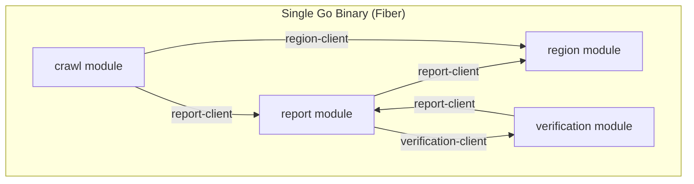
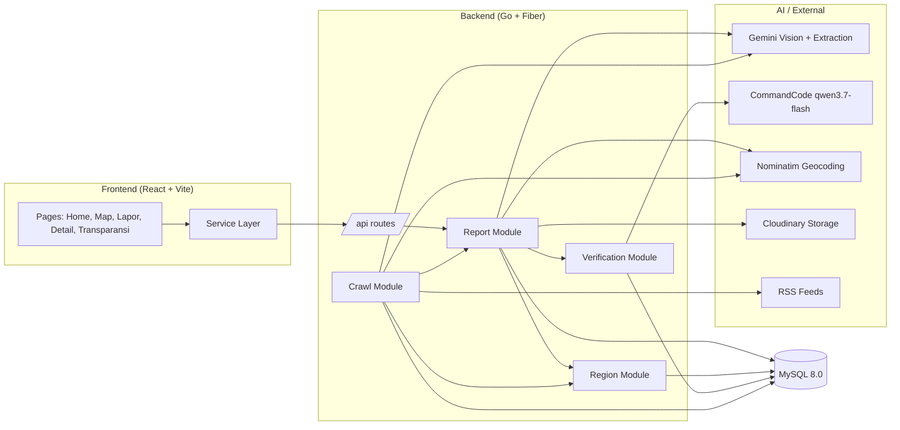
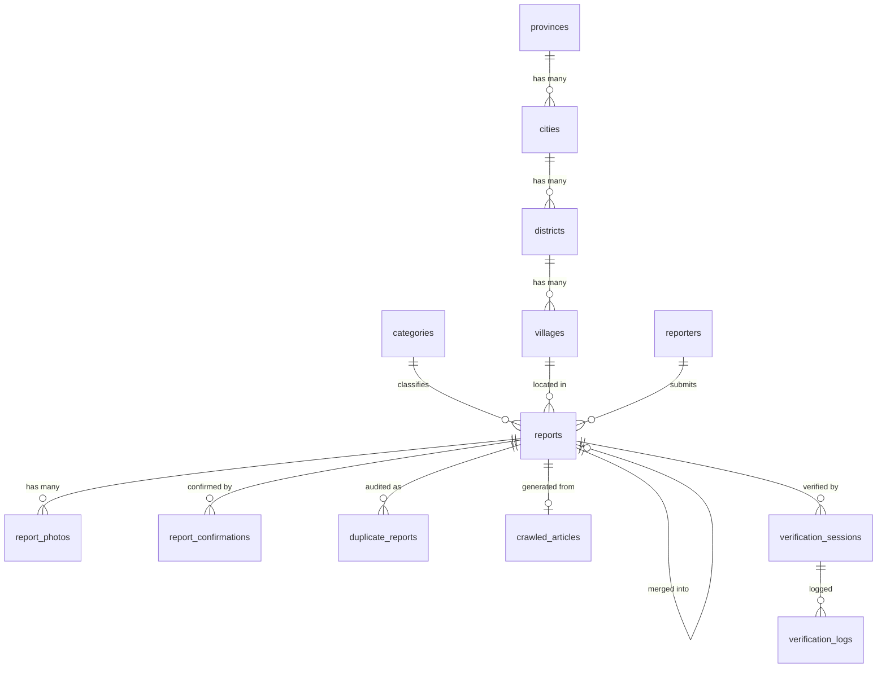

<p align="center">
  <a href="https://fixora-frontend.pages.dev/"></a>
  <a href="https://github.com/arttVinci/fixora-Frontend"></a>
  <a href="https://github.com/arttVinci/fixora-Backend"></a>
  
  <a href="LICENSE"></a>
</p>

# Fixora — Infrastructure Neglect Tracker

**Fixora** adalah platform open-source berbasis peta interaktif yang dirancang untuk melacak, memvisualisasikan, dan mendorong akuntabilitas terhadap kerusakan infrastruktur publik yang dibiarkan mangkrak di Indonesia.

> _"Berapa lama jalan ini berlubang? Siapa yang bertanggung jawab? Apakah ada anggaran perbaikan?"_  
> Fixora menjawab pertanyaan-pertanyaan ini dengan data terbuka, pelacakan durasi mangkrak, dan verifikasi AI multi-agent.

---

## Daftar Isi

- [Tim Developer](#tim-developer)
- [Tentang Proyek](#tentang-proyek)
- [Fitur Unggulan](#fitur-unggulan)
- [Demo & Screenshot](#demo--screenshot)
- [Teknologi](#teknologi)
- [Arsitektur Sistem](#arsitektur-sistem)
- [Instalasi & Setup](#instalasi--setup)
- [Penggunaan](#penggunaan)
- [API Documentation](#api-documentation)
- [Lisensi](#lisensi)

---

## Tim Developer

| Nama | Peran | GitHub |
|------|-------|--------|
| **[Putra Rizky Nugraha]** | Full-stack Developer | [GitHub](https://github.com/arttVinci) |
| **[Muhammad Fadhil Sevano]** | Full-stack Developer | [GitHub](https://github.com/MFSevanoo) |

---

## Tentang Proyek

### Latar Belakang

Di kota-kota besar Indonesia seperti Jakarta dan Bekasi, masalah infrastruktur publik yang dibiarkan rusak dalam waktu lama — jalan berlubang, jembatan rawan roboh, bangunan terbengkalai, sampah menumpuk, drainase tersumbat — adalah persoalan berulang yang jarang mendapat akuntabilitas jangka panjang. Platform pelaporan yang ada (Qlue, LAPOR!) punya dua kelemahan utama: model "lapor sekali, selesai" tanpa mekanisme pelacakan durasi masalah, dan bersifat pasif (hanya menunggu laporan warga) sehingga mengalami *cold-start problem* di awal.

### Solusi yang Ditawarkan

Fixora mengisi celah ini dengan tiga diferensiasi kunci:

1. **Pelacakan durasi mangkrak** — bukan sekadar lapor, tapi mendokumentasikan *sudah berapa lama* suatu titik masalah dibiarkan.
2. **AI News Crawler otonom** — secara aktif mencari berita kerusakan infrastruktur dari media, sehingga platform punya data sejak hari pertama tanpa menunggu laporan warga.
3. **Verifikasi berlapis AI** — pipeline multi-agent (Advocate → Skeptic → Manager) memvalidasi setiap laporan sebelum tayang di peta publik.

### Tujuan Proyek

- **Tujuan Utama**: Membangun platform *crowdsourced + AI-driven* yang memetakan masalah infrastruktur publik secara transparan dan akuntabel.
- **Target Pengguna**: Warga umum, media/jurnalis data, aktivis, pemerintah daerah, dan kontributor open source.
- **Value Proposition**: Platform yang tidak hanya menerima laporan, tapi aktif mencari isu lewat AI, melacak durasi masalah dibiarkan, dan mengkorelasikan lokasi laporan dengan data anggaran resmi.

---

## Fitur Unggulan

### Fitur Utama

| Fitur | Deskripsi | Keunggulan |
|----------|--------------|---------------|
| **Peta Interaktif** | Peta penuh dengan marker per kategori, *clustering*, heatmap, dan filter | Identifikasi cepat jenis & lokasi masalah di sekitar |
| **AI Vision Classifier** | Auto-deteksi kategori & severity dari foto yang diunggah | Warga tidak perlu memilih kategori manual |
| **AI News Crawler** | Cron job menarik berita dari RSS lalu LLM mengekstrak lokasi/kategori/severity | Data tersedia tanpa menunggu laporan warga |
| **Multi-Agent Verification** | Advocate, Skeptic, dan Manager memverifikasi laporan via LLM | Data yang tayang kredibel & teraudit |
| **Timer Durasi Mangkrak** | Menghitung hari/bulan sejak masalah pertama dilaporkan | Bukti akuntabilitas jangka panjang |
| **Deteksi Duplikat** | *Perceptual hashing* + radius GPS + kategori untuk deteksi & *soft-merge* duplikat | Peta bebas entri spam/duplikat |

### Fitur Tambahan

- **Konfirmasi "Masih Begini"** - komunitas mengonfirmasi kondisi lapangan untuk menjaga akurasi data.
- **Halaman Transparansi** - leaderboard titik mangkrak terlama + ekspor dataset (CSV/JSON) untuk jurnalis.
- **Verification Audit Trail** - log setiap panggilan agent (role, model, confidence, latency) bisa ditelusuri.

---

## Demo & Screenshot

### Live Demo

**[Kunjungi Website](https://fixora-frontend.pages.dev/)**

### Screenshot Aplikasi

<div align="center">
  
  <p><em>Homepage - Landing page dengan statistik laporan</em></p>

  
  <p><em>Peta Interaktif - Marker cluster & filter kategori</em></p>

  
  <p><em>Lapor Masalah - AI Vision auto-fill kategori & severity</em></p>

  
  <p><em>Detail Laporan - Timeline verifikasi multi-agent</em></p>
</div>

### Video Demo

**[Link Video Demo](https://[URL_VIDEO])** _(opsional)_

---

## Teknologi

### Tech Stack

#### Frontend


| Komponen | Teknologi | Keterangan |
|----------|-----------|------------|
| **Framework** | React 19 + TypeScript 5 | UI deklaratif dengan type-safety ketat |
| **Build Tool** | Vite 6 | Lightning-fast HMR & optimasi build modern |
| **Styling** | Tailwind CSS 3 | Utility-first CSS framework responsif |
| **Routing** | React Router 7 | Client-side routing SPA |
| **Peta Interaktif** | Leaflet + React-Leaflet + MapLibre GL | Visualisasi spasial, marker clustering & tile layer |
| **Animasi** | Framer Motion | Transisi halaman halus & mikro-interaksi dinamis |
| **Ikon** | React Icons | Icon library komprehensif |

#### Backend


| Komponen | Teknologi | Keterangan |
|----------|-----------|------------|
| **Runtime & Bahasa** | Go (Golang) 1.25 | Kompilasi native, concurrency tinggi, footprint memori minimal |
| **Web Framework** | Fiber v2 | HTTP framework performa tinggi berbasis Fasthttp |
| **Database** | MySQL 8.0 | Penyimpanan relasional untuk hierarki wilayah & data laporan |
| **ORM** | GORM v1 | Object-Relational Mapping, relasi multi-tabel & auto-migration |
| **Scheduler** | robfig/cron v3 | Background cron scheduler untuk crawling berita otomatis |
| **Validasi** | go-playground/validator | Validasi data input payload DTO |
| **Konfigurasi** | Viper | Manajemen konfigurasi environment variables & JSON |
| **Logging** | Logrus | Structured logging untuk audit trail & operational debugging |

#### AI & External Services


| Layanan | Provider / Tools | Peran dalam Sistem |
|---------|------------------|-------------------|
| **Multimodal Vision** | Google Gemini (Gemini 2.5 Flash) | Auto-klasifikasi kategori & keparahan foto kerusakan |
| **Multi-Agent Verifier** | CommandCode (Qwen) + Gemini | Pipeline multi-agent (Advocate, Skeptic, Manager) untuk validasi laporan |
| **Media Storage** | Cloudinary | CDN & hosting foto laporan kerusakan infrastruktur |
| **Geocoding** | Nominatim (OpenStreetMap) | Resolusi koordinat GPS ke alamat wilayah administratif |

#### DevOps & Tools


| Tool | Kategori | Kegunaan |
|------|----------|----------|
| **Docker** | Containerization | Packaging aplikasi ke dalam container terisolasi |
| **Docker Compose** | Multi-Container Setup | Menjalankan backend & database MySQL dalam satu perintah |
| **Swagger (Swaggo)** | API Documentation | Dokumentasi interaktif OpenAPI di `/swagger/` |
| **Git & GitHub** | Version Control | Kolaborasi tim, code review & version tracking |

### Alasan Pemilihan Teknologi

| Teknologi | Alasan Pemilihan |
|-----------|------------------|
| **Go + Fiber** | Performa tinggi & ringan untuk API, cocok untuk modular monolith dengan banyak worker background |
| **GORM** | Migrasi otomatis + relasi antar tabel wilayah/report yang kompleks |
| **React 19 + Vite** | DX cepat, ekosistem peta (react-leaflet) matang |
| **Leaflet** | Open source, gratis, tanpa biaya API seperti Google Maps |
| **Gemini Vision** | Klasifikasi foto multimodal dengan *structured output* (JSON schema) |
| **Nominatim** | Reverse/forward geocoding gratis berbasis OpenStreetMap |

### Dependencies Utama

**Frontend** (`package.json`):
```json
{
  "dependencies": {
    "react": "^19.2.1",
    "react-router-dom": "^7.18.3",
    "leaflet": "^1.9.4",
    "react-leaflet": "^5.0.0",
    "maplibre-gl": "^6.0.0",
    "framer-motion": "^12.43.0",
    "tailwindcss": "^3.4.17"
  }
}
```

**Backend** (`go.mod`):
```
github.com/gofiber/fiber/v2          v2.52.14
gorm.io/gorm                          v1.30.0
gorm.io/driver/mysql                  v1.6.0
github.com/google/generative-ai-go    v0.20.1
github.com/robfig/cron/v3             v3.0.1
github.com/spf13/viper                v1.21.0
github.com/sirupsen/logrus            v1.9.4
github.com/mmcdole/gofeed             v1.4.0
```

---

## Arsitektur Sistem

Backend Fixora dibangun dengan pendekatan **Modular Monolith** (bukan microservices). Seluruh fitur berada dalam satu binary Go yang di-deploy sebagai satu proses, namun dipisahkan secara ketat menjadi modul-modul berdomain sendiri.

### Mengapa Modular Monolith?

| Aspek | Penjelasan |
|-------|------------|
| **Satu deployment** | Seluruh modul (`report`, `region`, `verification`, `crawl`) berjalan dalam satu binary — tidak ada overhead jaringan antar-modul |
| **Batas domain jelas** | Setiap modul mengikuti Clean Architecture: `controller` → `usecase` → `repository` → `entity` |
| **Komunikasi antar-modul via interface** | Modul tidak saling import langsung; mereka berkomunikasi melalui kontrak `*-client` (mis. `report-client`, `region-client`) |
| **Migrasi independen** | Setiap modul punya `Migrate()` sendiri dan menjalankan auto-migrate tabelnya masing-masing |
| **Mudah dievolusi** | Modul bisa dipecah menjadi service terpisah di kemudian hari tanpa menulis ulang domain logic |



### System Architecture



### Database Schema



> Lihat skema lengkap di [DATABASE-SCHEMA.md](https://github.com/arttVinci/fixora-Backend/blob/main/docs/DATABASE-SCHEMA.md).

### Folder Structure

```
fixora/
├── frontend-Fixora/                 # Frontend React + TypeScript
│   ├── src/
│   │   ├── components/              # Reusable UI + Map components
│   │   ├── pages/                   # Page components (route)
│   │   ├── hooks/                   # Custom hooks (useCategories)
│   │   ├── services/                # API service layer
│   │   ├── types/                   # TypeScript types
│   │   └── utils/                   # Utility functions (status, date, stats)
│   ├── public/                      # Static assets (logo, images)
│   └── index.html
└── backend-Fixora/                  # Backend Go + Fiber
    ├── cmd/web/                     # Entrypoint (main.go)
    ├── internal/
    │   ├── modules/                 # Feature modules (Modular Monolith)
    │   │   ├── report/              #   Inti: CRUD, peta, CV classifier
    │   │   ├── region/              #   Hierarki wilayah Indonesia
    │   │   ├── verification/        #   Multi-agent AI verification
    │   │   └── crawl/               #   AI news crawler
    │   └── shared/                  # Shared: config, client, dto, repository
    ├── database/                    # Seeders (region SQL) & migrations
    └── docs/                        # Dokumentasi (PRD, schema, swagger)
```

---

## Instalasi & Setup

Proyek Fixora terbagi ke dalam dua repositori utama: **Backend** (API & Multi-Agent AI Service) dan **Frontend** (Aplikasi Web Interaktif). Seluruh instruksi instalasi lengkap, konfigurasi berkas `.env`/`config.json`, migrasi database, dan petunjuk troubleshooting dirawat langsung di repositori masing-masing:

| Komponen | Repositori | Panduan Setup | Deskripsi Singkat |
|----------|------------|---------------|-------------------|
| **Backend** | [`arttVinci/fixora-Backend`](https://github.com/arttVinci/fixora-Backend) | [README Backend](https://github.com/arttVinci/fixora-Backend/blob/main/README.md) | Go 1.25, Fiber v2, Docker Compose, MySQL 8, migrasi database, dan konfigurasi API key AI (Gemini / Cloudinary) |
| **Frontend** | [`arttVinci/fixora-Frontend`](https://github.com/arttVinci/fixora-Frontend) | [README Frontend](https://github.com/arttVinci/fixora-Frontend/blob/main/README.md) | React 19, Vite, TypeScript, Tailwind CSS, Leaflet Map, dan konfigurasi base URL API |

### Quick Start (Clone Repositori Monorepo)

Jika Anda ingin mengklon repositori utama ini beserta seluruh submodulnya sekaligus:

```bash
# Clone repositori utama beserta seluruh submodule
git clone --recurse-submodules https://github.com/arttVinci/fixora.git
cd fixora
```

Setelah repositori terklon, buka panduan di masing-masing direktori:
- **Setup Backend**: Buka direktori `backend-Fixora/` lalu ikuti panduan di [README Backend](https://github.com/arttVinci/fixora-Backend/blob/main/README.md).
- **Setup Frontend**: Buka direktori `frontend-Fixora/` lalu ikuti panduan di [README Frontend](https://github.com/arttVinci/fixora-Frontend/blob/main/README.md).

---

## Penggunaan

### User Guide

#### Untuk Pengguna Umum (Melaporkan Masalah)

1. **Buka peta** (`/peta`) untuk melihat titik masalah di sekitar Anda.
2. **Klik "Lapor Masalah"** lalu unggah foto kerusakan.
3. **AI auto-fill** judul, kategori, dan severity dari foto (pastikan foto punya stempel tanggal/waktu & teks lokasi).
4. **Konfirmasi lokasi** (auto GPS atau geser pin di peta), isi deskripsi (opsional), lalu submit.
5. Laporan masuk **antrian verifikasi**; setelah lolos verifikasi AI, tayang di peta publik.

#### Untuk Pemantau / Jurnalis

1. **Jelajahi peta** dengan filter kategori, status, severity, dan sumber data.
2. **Klik titik** untuk melihat detail (foto, riwayat, durasi mangkrak, log verifikasi).
3. **Konfirmasi "Masih Begini"** jika kondisi masih berlanjut.
4. **Buka halaman Transparansi** (`/transparansi`) untuk leaderboard + ekspor data (CSV/JSON).

#### Untuk Operator (Admin / Dev)

1. **Trigger crawler manual** di halaman Transparansi → tab Crawler, atau `POST /api/crawl/trigger`.
2. **Retry verifikasi gagal** via `POST /api/crawl/verify/retry/:sessionId`.
3. **Pantau sesi verifikasi** via `GET /api/crawl/verify/sessions/:reportId`.

---

## API Documentation

Seluruh layanan backend Fixora menyediakan REST API berkecepatan tinggi dengan response envelope JSON standar.

### Base URL & Interactive Docs

| Lingkungan | Base URL | Swagger UI Interactive Docs |
|------------|----------|-----------------------------|
| **Production** | `https://api.portofy.net/api` | [Buka Swagger UI (Live)](https://api.portofy.net/swagger/index.html) |
| **Development** | `http://localhost:8080/api` | [Buka Swagger UI (Local)](http://localhost:8080/swagger/index.html) |

> Spesifikasi OpenAPI lengkap dapat diakses melalui file [`swagger.yaml`](https://github.com/arttVinci/fixora-Backend/blob/main/docs/swagger.yaml).

### Daftar Endpoint

#### 1. Laporan & Peta (Reports & Categories)

| Method | Endpoint | Parameter / Payload | Deskripsi |
|:---|:---|:---|:---|
| `GET` | `/api/reports/map` | `min_lat`, `max_lat`, `min_lng`, `max_lng`, filter | Data titik peta berbasis *bounding box* dan filter status/severity |
| `GET` | `/api/reports/:id` | `:id` (UUID) | Detail lengkap laporan, foto, konfirmasi warga, dan laporan terkait |
| `POST` | `/api/reports/analyze-photo` | `photo` (multipart/form-data) | Analisis foto AI Vision (deteksi kategori, keparahan, deskripsi) |
| `POST` | `/api/reports` | JSON payload | Submit laporan baru dari warga |
| `GET` | `/api/categories` | — | Daftar seluruh kategori kerusakan infrastruktur |

#### 2. Crawler & Verifikasi Multi-Agent (AI Pipeline)

| Method | Endpoint | Parameter / Payload | Deskripsi |
|:---|:---|:---|:---|
| `POST` | `/api/crawl/trigger` | — | Trigger manual AI News Crawler di background |
| `POST` | `/api/crawl/verify/trigger/:reportId` | `:reportId` (UUID) | Menjalankan pipeline verifikasi multi-agent (Advocate, Skeptic, Manager) |
| `POST` | `/api/crawl/verify/retry/:sessionId` | `:sessionId` (UUID) | Mengulang kembali sesi verifikasi yang berstatus error |
| `GET` | `/api/crawl/verify/sessions/:reportId` | `:reportId` (UUID) | Riwayat sesi verifikasi beserta audit log setiap agen AI |

### Format Response Standar

Setiap response API menggunakan format envelope JSON seragam:

```json
{
  "data": { ... },
  "message": "Pesan status respons",
  "success": true
}
```

### Contoh Integrasi (JavaScript Fetch)

```javascript
// 1. Mengambil titik laporan untuk peta interaktif
const mapRes = await fetch(
  '/api/reports/map?min_lat=-8.5&max_lat=-5.5&min_lng=105.5&max_lng=109.5'
);
const { data: markers } = await mapRes.json();

// 2. Analisis foto kerusakan dengan AI Vision
const formData = new FormData();
formData.append('photo', photoFile);

const analyzeRes = await fetch('/api/reports/analyze-photo', {
  method: 'POST',
  body: formData,
});
const { data: aiDraft } = await analyzeRes.json();

// 3. Submit laporan warga menggunakan session foto staging
const submitRes = await fetch('/api/reports', {
  method: 'POST',
  headers: { 'Content-Type': 'application/json' },
  body: JSON.stringify({
    category_id: aiDraft.category_id,
    title: aiDraft.title,
    description: aiDraft.description,
    latitude: -6.2349858,
    longitude: 106.9945444,
    severity: aiDraft.severity,
    staging_session_id: aiDraft.session_id,
    reporter_email: 'warga@example.com',
  }),
});
```

---

## Lisensi

Proyek ini dilisensikan di bawah [MIT License](LICENSE) - lihat file LICENSE untuk detail lebih lanjut.

---

<div align="center">

  **Fixora — Platform Transparansi & Akuntabilitas Infrastruktur Publik**

</div>
